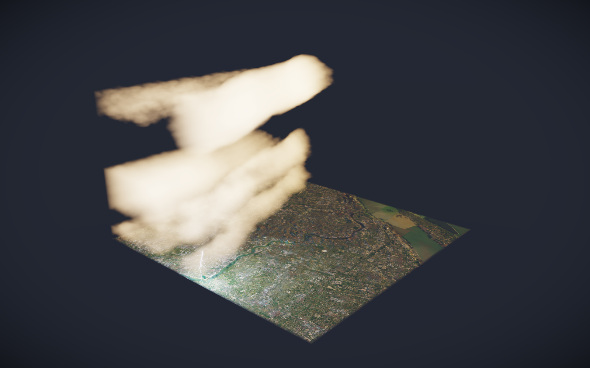

# Immersive Weather

A tabletop-scale VR weather visualisation for PICO / Meta Quest 3S. Place a
50 km × 50 km slice of Shanghai on a real table, then walk around it and look
*into* the atmosphere above it: satellite basemap, terrain relief, volumetric
cloud at true altitudes, and lightning that lights both the cloud and the map.


*The app running on the PICO Emulator (PICO OS 6, x86_64 image). The panel beside
the map is the provenance HUD — it reports the region and scale, where each layer
came from, the current cloud/rain/CAPE figures, and which parts are derived rather
than observed. 54 fps, 20 strikes/min.*

---

## Offline hero render

The same scene rendered offline at higher quality (2× supersampled, HDR bloom +
ACES tonemap + vignette) via `Tools ▸ WeatherVR ▸ Render Hero Shot`:



Real Shanghai terrain and imagery — the Huangpu winding through the centre, the
Yangtze estuary top-right — under the synthetic demo storm, with a lightning
strike into the western districts.

---

## Status

| Piece | State |
| --- | --- |
| Terrain mesh + satellite basemap | ✅ real SRTM-derived elevation, real Esri imagery |
| Volumetric raymarched clouds | ✅ at true altitudes from the weather model |
| Lightning + spatial thunder | ✅ derived placement, per-distance synthesised audio |
| Map placement (controller / hand) | ✅ preview → commit → world-locked |
| Live weather ingest | ✅ Open-Meteo, key-less, with baked + procedural fallbacks |
| Android APK | ✅ builds clean, runs on the PICO Emulator |
| Desktop preview | ✅ flat Windows build, mouse-orbit |
| On real PICO hardware | ⚠️ never tested — no device available |

---

## Quick start

```powershell
# 1. Bake the data (optional — the app generates every layer procedurally without it)
pip install -r tools/requirements.txt
python tools/build_all.py

# 2. Sanity-check the maths (~1 s, runs outside Unity)
python tools/verify.py

# 3. In Unity 2022.3.62f3:
#      Tools ▸ WeatherVR ▸ Build Scene
#      Tools ▸ WeatherVR ▸ Build APK
```

Or headless, from a clean checkout:

```powershell
& "C:\Program Files\Unity\Hub\Editor\2022.3.62f3\Editor\Unity.exe" `
    -batchmode -quit -projectPath "." `
    -executeMethod WeatherVR.EditorTools.BuildAPK.BuildEverythingFromCommandLine
```

Nothing needs wiring by hand. The scene, the config asset, the player settings
and the shader inclusion list are all generated or asserted from code.

### Three ways to run it

| Target | Command | Notes |
| --- | --- | --- |
| **PICO Emulator** | `adb install -r -t --abi arm64-v8a Builds/ImmersiveWeather.apk` | `--abi arm64-v8a` is required — see below |
| **Desktop (flat)** | `Tools ▸ WeatherVR ▸ Build Desktop Preview` → run the .exe | mouse-orbit, no headset needed |
| **Real headset** | `adb install -r Builds/ImmersiveWeather.apk` | untested |

---

## Using it

| Action | Controller | Hands |
| --- | --- | --- |
| Aim at a surface | point | point |
| Place the map | trigger | pinch |
| Move it again | hold grip ~1 s | — |

Desktop preview: **drag** orbit · **scroll** zoom · **WASD/QE** move · **Esc** quit.

---

## What is real and what is not

This matters, because roughly half of what you see is inferred rather than
measured — and none of it *looks* inferred. The app states this on the panel
beside the map; this is the same information in more detail.

| Layer | Source | Honest? |
| --- | --- | --- |
| Terrain | AWS Terrain Tiles (SRTM-derived), 90 m class | **Measured** |
| Basemap | Esri World Imagery, true colour | **Measured** |
| Cloud cover, rain, wind, CAPE | Open-Meteo (ECMWF/DWD/NOAA), live | **Measured**, ~10–30 km grid |
| Cloud layer altitudes | Barometric conversion of ECMWF pressure levels | **Derived**, standard formula |
| Cloud *shape* | Procedural noise | **Invented.** No operational model resolves a cumulus tower. |
| Lightning | CAPE × rain rate proxy | **Derived.** No free feed publishes stroke density. |
| Everything, offline | Procedural | **Synthetic**, labelled "procedural" on screen. |

Vertical scale is exaggerated ×4 relative to horizontal by default
(`VerticalExaggeration`). At true scale a 2 km cloud deck over a 2 m map is an
8 cm film — accurate and unreadable.

### Demo mode

Shanghai is usually clear; a live snapshot is often an empty sky with no
lightning, which is correct and impossible to demo. `ForceProceduralWeather` on
`Assets/WeatherVR/Resources/WeatherVRConfig.asset` always renders the synthetic
squall line. The provenance panel still reports it as *procedural (demo mode)* —
it shows a storm without claiming one.

---

## Running on the PICO Emulator

Two non-obvious things are required, both handled in the repo:

**1. Declare hand tracking, or it will not launch.** PICO OS intercepts apps it
classifies as `ControllerOnly` while no controller is connected and parks them in
a pending queue:

```
AppStartInterceptManager: Intercepted for ControllerOnly:
    Controller paired but not connected. Pkg: com.weathervr.immersive
```

`PicoManifestPatcher` (an `IPostGenerateGradleAndroidProject` running after the
SDK's own pass) writes `handtracking=1`, `controller=1` and the
`com.picovr.permission.HAND_TRACKING` permission into the manifest.

**2. Install the ARM64 slice explicitly.** The emulator is an x86_64 image, but
its ABI list is `arm64-v8a,x86_64` — ARM first — and, critically, **PICO ships
its native libraries (`libopenxr_loader.so`, `libPxrPlatform.so`, the
spatialiser) for ARM64 only.** Installing the x86_64 slice gives you native CPU
speed and a **black screen**, because there is no XR runtime to composite
through. Measured both ways:

| Slice | Frame time | Renders? |
| --- | --- | --- |
| x86_64 (native) | 41.7 ms | ❌ black — no PICO XR natives |
| **arm64-v8a (translated)** | **17.0 ms** | ✅ yes |

The translated build is both *correct* and, in practice, faster. Always use
`--abi arm64-v8a`.

---

## Repository layout

```
CLAUDE.md                     spec + implementation notes + known issues
DEMO.md                       run-book for demoing it live
docs/screenshots/             the images in this README
tools/                        offline data pipeline (Python)
  build_all.py                runs all three fetchers, writes a manifest
  fetch_terrain.py            → StreamingAssets/WeatherData/terrain.bin
  fetch_satellite.py          → satellite.jpg
  fetch_weather.py            → weather.json  (Open-Meteo, or ERA5 with a key)
  verify.py                   runs the maths checks outside Unity
Assets/WeatherVR/
  Scripts/Core/               config, scale, orchestration, perf governor, solar position
  Scripts/Data/               geo + atmosphere maths, ingest, procedural fallbacks
  Scripts/Terrain/            mesh generation and LOD
  Scripts/Clouds/             density volume, raymarch driver
  Scripts/Lightning/          strike scheduling, channel geometry
  Scripts/Audio/              fully synthesised thunder, wind, rain
  Scripts/Interaction/        pointing, head tracking, map placement
  Scripts/Desktop/            flat preview camera for running without a headset
  Shaders/                    terrain, volumetric clouds, lightning, sky, post
  Editor/                     scene generator, settings fixer, APK/desktop build, hero render
```

---

## Checks

```powershell
python tools/verify.py
```

Compiles the runtime scripts from source and runs them on a plain .NET runtime —
no editor lock needed, which matters because Unity holds that lock nearly all the
time during development. 35 checks covering the barometric formula against
standard-atmosphere reference points, solar position at both solstices, that the
cloud detail volume tiles seamlessly on all three axes, that the real baked
`terrain.bin` decodes to a delta-flat median, and that map-unit conversions can't
regress.

Anything needing the engine — shaders, `Texture3D`, MonoBehaviour lifecycles —
has to be checked by building or pressing Play.

---

## Performance

Targets 72 FPS on headset-class hardware. The cloud raymarch is the adjustable
load: `PerfGovernor` measures frame time and spends march steps and cloud
self-shadowing before it spends frame rate. The shader integrates each segment
analytically rather than as a Riemann sum, so dropping steps softens the clouds
without changing their brightness — which is what makes the throttling invisible.

Budget: ≤40 k triangles of terrain, ≤48 raymarch steps, ≤3 concurrent bolts.

In the emulator it settles at ~17 ms/frame with clouds throttled to `minimum` —
expected, since it is running ARM code under binary translation on a desktop GPU
path.

---

## Known issues

- **Never run on real PICO hardware.** Everything here was validated in the
  emulator, in a flat desktop build, and via offline renders.
- **Cloud quality throttles hard in the emulator** — the governor drops to
  `minimum` steps to hold frame rate, so clouds look softer than the hero render.
- **PICO native libs are ARM64-only**, so an x86_64 install cannot render (see
  above). The hand-tracking path latches itself off if those libraries are
  missing rather than throwing every frame.
- **Sun angle follows the real observation time**, so an evening snapshot renders
  a dim scene. Correct, but not always flattering.

---

## Attribution

- Elevation: AWS Terrain Tiles (`elevation-tiles-prod`), derived from SRTM and
  other public sources.
- Imagery: © Esri — Maxar, Earthstar Geographics, and the GIS User Community.
- Weather: [Open-Meteo.com](https://open-meteo.com) (CC BY 4.0), from ECMWF, DWD
  and NOAA models.
- Lightning is **not** observed data — it is derived from CAPE and precipitation
  rate. See `Atmosphere.LightningPotential`.
