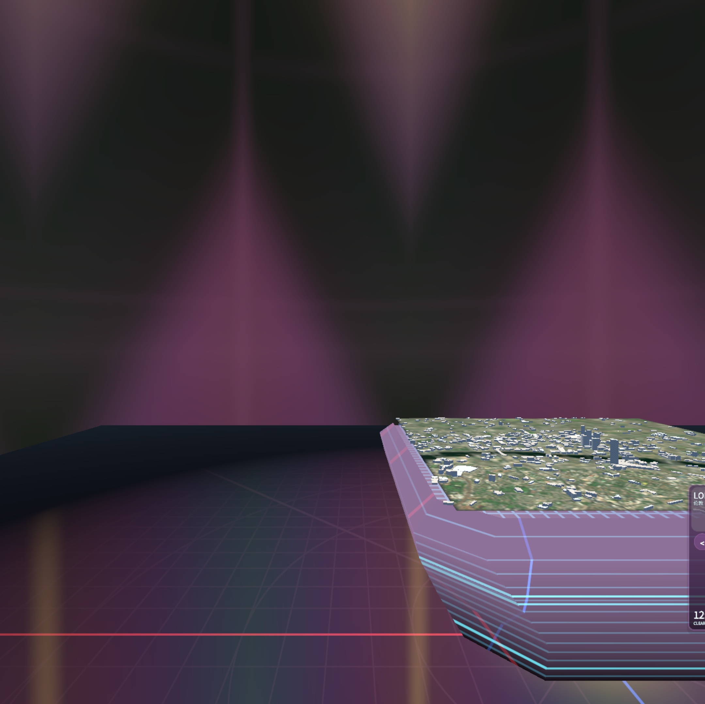

# Immersive Weather

A tabletop-scale VR weather visualisation for PICO / Meta Quest 3S. A 5 km × 5 km
slice of the City of London rides in front of you on a glass plinth — satellite
basemap, terrain relief, OpenStreetMap building massing — under a weather scene
you pick from a forecast carousel and scrub through a 24-hour clock.



*The app running immersively on the PICO Emulator (PICO OS 6). The faceted glass
pedestal carries the coordinate graticule; the floor and sky share one
kaleidoscope fold. 60 fps.*

---

## Adventure X submission

PicoWeather is an **Adventure X submission**. A ready-to-install PICO APK is
included at `Builds/ImmersiveWeather.apk`.

### Run on the PICO OS 6 emulator

Launch the PICO OS 6 emulator, confirm it appears in `adb devices`, then push
the APK to the emulator and start it:

```powershell
adb install -r Builds/ImmersiveWeather.apk
adb shell monkey -p com.weathervr.immersive `
    -c android.intent.category.LAUNCHER 1
```

The APK is ARM64-only and runs through the emulator's ARM64 translation layer.
Allow roughly 30 seconds for the first immersive frame after launch.

### Run on a physical PICO device

Enable Developer Mode and USB debugging on the headset, connect it by USB,
accept the debugging prompt inside the headset, and confirm it appears in
`adb devices`. Install and launch the same APK:

```powershell
adb install -r Builds/ImmersiveWeather.apk
adb shell monkey -p com.weathervr.immersive `
    -c android.intent.category.LAUNCHER 1
```

Put on the headset after launch. The app declares both controller and hand
tracking support, so it can enter immersive mode without being blocked while a
controller is disconnected.

---

## Status

| Piece | State |
| --- | --- |
| Terrain mesh + satellite basemap | ✅ real SRTM-derived elevation, real Esri imagery |
| Building massing | ✅ real OpenStreetMap footprints + heights, ~600 buildings |
| Weather scenes | ✅ 9 profiles, cloud deck / rain / snow / lightning flash |
| Forecast carousel + 24 h time scrubber | ✅ 5 day cards, weather resolved per (day, hour) |
| Flood surge overlay | ✅ +0/+2/+5/+10 m, thunderstorm only |
| Live weather ingest | ✅ Open-Meteo, key-less, with baked + procedural fallbacks |
| Android APK | ✅ builds clean, runs **immersive** on the PICO Emulator at 60 fps |
| Desktop preview | ✅ flat Windows build, mouse-orbit |
| On real PICO hardware | ⚠️ never tested — no device available |

---

## Quick start

```powershell
# 1. Bake the data (optional — the app generates every layer procedurally without it)
pip install -r tools/requirements.txt
python tools/build_all.py

# 2. Sanity-check the maths (~1 s, runs outside Unity)
python tools/verify.py

# 3. In Unity 2022.3.62f3:
#      Tools ▸ WeatherVR ▸ Build Scene
#      Tools ▸ WeatherVR ▸ Build APK
```

Or headless, from a clean checkout:

```powershell
& "C:\Program Files\Unity\Hub\Editor\2022.3.62f3\Editor\Unity.exe" `
    -batchmode -quit -projectPath "." `
    -executeMethod WeatherVR.EditorTools.BuildAPK.BuildEverythingFromCommandLine
```

Nothing needs wiring by hand. The scene, the config asset, the player settings,
the XR loader and the shader inclusion list are all generated or asserted from
code.

### Three ways to run it

| Target | Command | Notes |
| --- | --- | --- |
| **PICO Emulator** | `adb install -r Builds/ImmersiveWeather.apk` | ARM64-only build; runs immersive — see below |
| **Desktop (flat)** | `Tools ▸ WeatherVR ▸ Build Desktop Preview` → run the .exe | mouse-orbit, no headset needed |
| **Real headset** | `adb install -r Builds/ImmersiveWeather.apk` | untested |

Prebuilt APKs live in [`dist/`](dist/).

---

## Using it

The map is **not** placed on a surface. It follows your head lazily
(`ComfortFollow`), easing into view ahead of you and staying world-upright, so
there is nothing to set up before you can look at it.

| Action | Controller | Hands |
| --- | --- | --- |
| Point at the panel | point | point |
| Select a day / press a button | trigger | pinch |
| Drag the time slider | trigger, hold and move | pinch and move |
| Walk around the map | left joystick | unavailable |
| Smooth turn | right joystick left/right | unavailable |
| Zoom toward / away from the map | right joystick forward/back | unavailable |
| Re-centre the map in front of you | secondary button | — |

Tapping a day card switches the whole scene — cloud, precipitation, sky, fog,
floor tint and pedestal rim all grade together. The slider under the metrics
strip scrubs 0–24 h in half-hour steps, driving a real solar arc (sunrise 06:00,
noon 12:00, sunset 18:00) and crossing into a different weather case when the
day's timeline says so.

Desktop preview: **drag** orbit · **scroll** zoom · **WASD/QE** move · **Esc** quit.

---

## What is real and what is not

This matters, because a good deal of what you see is inferred rather than
measured — and none of it *looks* inferred.

| Layer | Source | Honest? |
| --- | --- | --- |
| Terrain | AWS Terrain Tiles (SRTM-derived), 90 m class | **Measured** |
| Basemap | Esri World Imagery, true colour | **Measured** |
| Buildings | OpenStreetMap footprints, `height`/`building:levels` | **Measured** where tagged, estimated where not |
| Cloud cover, rain, wind, CAPE | Open-Meteo (ECMWF/DWD/NOAA), live | **Measured**, ~10–30 km grid |
| Cloud layer altitudes | Barometric conversion of ECMWF pressure levels | **Derived**, standard formula |
| Cloud *shape* | Billboard particle deck driven by the profile | **Invented.** No operational model resolves a cumulus tower. |
| Lightning | CAPE × rain rate proxy | **Derived.** No free feed publishes stroke density. |
| Flood surge heights | Fixed +2/+5/+10 m presets | **Illustrative.** Not a hydrological model. |
| The demo week | Authored timelines | **Synthetic**, see below. |

Vertical scale is exaggerated ×0.4 relative to horizontal (`VerticalExaggeration`),
with an extra ×1.2 on terrain relief alone (`TerrainReliefExaggeration`). Both are
tuned for the current 5 km span and scale inversely with it — changing
`RegionSpanKm` without retuning them is a mistake this project has already made
once. A 2 km cloud deck sits ~29 cm above the table.

### Demo mode

London is usually unremarkable; a live snapshot is often an overcast sky with no
lightning, which is correct and impossible to demo. `ForceProceduralWeather` on
`Assets/WeatherVR/Resources/WeatherVRConfig.asset` always renders the synthetic
squall line, and the carousel's authored week deliberately covers all nine
weather cases so none is unreachable.

---

## Running on the PICO Emulator

Two non-obvious things are required, both handled in the repo:

**1. Declare hand tracking, or it will not launch.** PICO OS intercepts apps it
classifies as `ControllerOnly` while no controller is connected and parks them in
a pending queue:

```
AppStartInterceptManager: Intercepted for ControllerOnly:
    Controller paired but not connected. Pkg: com.weathervr.immersive
```

`PicoManifestPatcher` (an `IPostGenerateGradleAndroidProject` running after the
SDK's own pass) writes `handtracking=1`, `controller=1` and the
`com.picovr.permission.HAND_TRACKING` permission into the manifest.

**2. Build ARM64-only, or the app is not immersive.** The emulator is an x86_64
image whose ABI list is `arm64-v8a,x86_64`, but **PICO ships its native libraries
(`libopenxr_loader.so`, `libPxrPlatform.so`, the spatialiser) for ARM64 only**.
Run the x86_64 slice and there is no XR plugin to load: the XR display subsystem
never starts, Unity renders to an ordinary Android surface, and the PICO shell
frames the app as a flat 2D panel on the wall. It looks like it works. Measured
both ways on 2026-07-25:

| Slice | XR display | Result |
| --- | --- | --- |
| x86_64 (native) | never starts | ❌ flat 2D panel in the shell |
| **arm64-v8a (translated)** | `PXR_Loader Initialize()` | ✅ immersive, 60/60 fps |

`ProjectConfigurator` therefore forces ARM64-only *and* asserts the PICO XR
loader on every build — the loader list is shared with the phone-AR and
phone-touch variants, which legitimately clear it, and a headset build that
inherits an empty list fails silently in exactly the way above.

Translated ARM code costs startup, not frame rate: ~33 s to the first frame
against ~10 s for x86_64, then a steady 60 fps at ~5 ms CPU and ~2.5 ms GPU.

---

## Repository layout

```
CLAUDE.md                     spec + implementation notes + known issues
DEMO.md                       run-book for demoing it live
docs/screenshots/             the images in this README
dist/                         prebuilt sideload APKs
tools/                        offline data pipeline (Python)
  build_all.py                runs the fetchers, writes a manifest
  fetch_terrain.py            → StreamingAssets/WeatherData/terrain.bin
  fetch_satellite.py          → satellite.jpg
  fetch_buildings.py          → buildings.json  (OSM Overpass)
  fetch_weather.py            → weather.json    (Open-Meteo, or ERA5 with a key)
  verify.py                   runs the maths checks outside Unity
Assets/WeatherVR/
  Scripts/Core/               config, scale, orchestration, solar position
  Scripts/Data/               geo + atmosphere maths, ingest, procedural fallbacks
  Scripts/Terrain/            terrain + building mesh generation and LOD
  Scripts/Weather/            scene profiles, director, environment, weather visuals
  Scripts/Flood/              storm-surge water plane
  Scripts/UI/                 forecast carousel, time scrubber, flood buttons
  Scripts/Lightning/          — removed; lightning now lives in Weather/WeatherVisuals
  Scripts/Audio/              fully synthesised thunder, wind, rain
  Scripts/Interaction/        pointing, head tracking, comfort follow
  Scripts/IntroEarth/         the opening globe
  Scripts/Phone/              AR + touch phone variants
  Scripts/Desktop/            flat preview camera for running without a headset
  Shaders/                    terrain, buildings, pedestal, glass surround, sky, water
  Editor/                     scene generator, settings fixer, APK/desktop builds
```

---

## Checks

```powershell
python tools/verify.py
```

Compiles the runtime scripts from source and runs them on a plain .NET runtime —
no editor lock needed, which matters because Unity holds that lock nearly all the
time during development. 36 checks covering the barometric formula against
standard-atmosphere reference points, solar position at both solstices, that the
cloud detail volume tiles seamlessly on all three axes, that the real baked
`terrain.bin` decodes sensibly, and that map-unit conversions can't regress.

Anything needing the engine — shaders, MonoBehaviour lifecycles, XR — has to be
checked by building or pressing Play.

---

## Performance

Targets 72 FPS on headset-class hardware, against a hand-checked budget: ≤40 k
triangles of terrain, ≤3 concurrent bolts, ≤2 ms CPU for everything outside the
main passes.

**There is no runtime adaptive-quality system.** Earlier versions of this README
described a `PerfGovernor` that traded cloud quality for frame rate; no such
class was ever written, and nothing sets `Application.targetFrameRate` or scales
quality at runtime. The budget is a target checked by hand and by the profiler,
not something the app enforces on its own.

Measured in the emulator (ARM64 under translation): a steady 60/60 fps —
its cap — at ~5 ms CPU and ~2.5 ms GPU per frame, no dropped frames.

---

## Known issues

- **Never run on real PICO hardware.** Everything here was validated in the
  emulator, in a flat desktop build, and via offline renders.
- **The volumetric cloud raymarch is gone.** It was removed in `f130fac` along
  with the old particle rain and lightning-bolt code; `Weather/WeatherVisuals`
  replaced it with a billboard cloud deck, particle precipitation and a pulsing
  flash. Documentation that describes raymarched volumetrics is out of date.
- **PICO native libs are ARM64-only**, so an x86_64 build cannot be immersive
  (see above). The hand-tracking path latches itself off if those libraries are
  missing rather than throwing every frame.
- **Two scene objects have missing script references** — harmless warnings at
  startup, but they mean a MonoBehaviour GUID in `WeatherVR.unity` no longer
  resolves.
- **Active Input Handling is set to Both**, which Unity warns is unsupported on
  Android and may affect input and performance.

---

## Attribution

- Elevation: AWS Terrain Tiles (`elevation-tiles-prod`), derived from SRTM and
  other public sources.
- Imagery: © Esri — Maxar, Earthstar Geographics, and the GIS User Community.
- Buildings: © OpenStreetMap contributors (ODbL), via the Overpass API.
- Weather: [Open-Meteo.com](https://open-meteo.com) (CC BY 4.0), from ECMWF, DWD
  and NOAA models.
- Lightning is **not** observed data — it is derived from CAPE and precipitation
  rate. See `Atmosphere.LightningPotential`.
